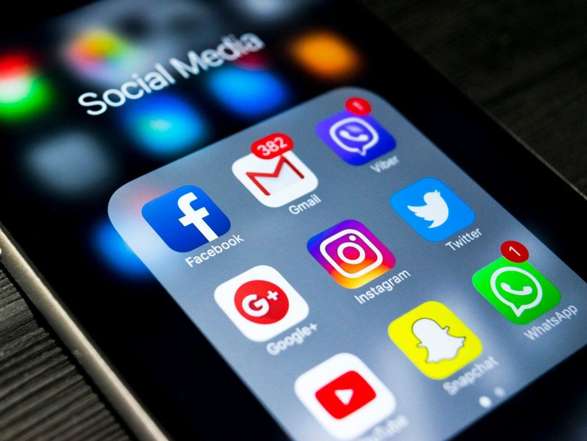

##We have created WeJustDontGiveAFuck.com 
to be the antithesis of the crap that we have to read online everyday. See, the web used to be a place where you could find interesting information about the news,various topics and things that you found interesting. To a certain extend, it still is…

Social media came about and gave us a way to share some of these interesting thigs with others. It all became popular and now there are so many fucking social media platforms that it makes me sick. Social media every fucking where, full of shit like what kind of shitty ass food you are eating, the stupid places that you visit and how your kid is better than mine. We just dont give a fuck!

## So people started using social media to share shit. 
Go to Facebook and “check in” at a place, just in time for the burglar to know that you are not at your fucking house and use the opportunity to break in. Then we get to read about your damn kids and their activities and successes with pictures included, just the type of shit you should not be sharing with a million fucking strangers and some potential perverts.

But hell, you have the need to be validated, you want to post about your little perfect life and for everyone to react with fake praise. Hey moron, all those “friends” are just faking approval of your perfect life. We love to see the perfect family with the perfect pictures, as they go on vacation and the kids make the honor roll, the parents get promoted at work and they travel the world. Everything is sunshine and butteflies. Social media creates an illusion that these morons lead a perfect life that we should all envy. In reality people watch waiting for bad shit to happen because we just dont give a fuck!

So the sunshine and butterflies suddenly disappear. Hey, junior and grandma thought that life was perfect; remember the vacation pics? So how surprising when six months later you are a divorced alcoholic. In other words, stop pretending your fucking lives are perfect and using social media to seek validation. In reality, we just dont give a fuck!

## We will make some time here to talk about sports, the weather, cars, and even our incompetent President.
Hey, we elected this guy to the White House. Do we need further proof that we just dont give a fuck?

As we continue this journey, on this site we will talk about shit that we run into when browsing the web. Well, some of these people post personal crap seeking attention. We will give them some attention even if just to say:

****WE JUST DONT GIVE A FUCK!!!

Sincerely,

Ray Donovan (owner and moderator of WeJustDontGiveAFuck.com.