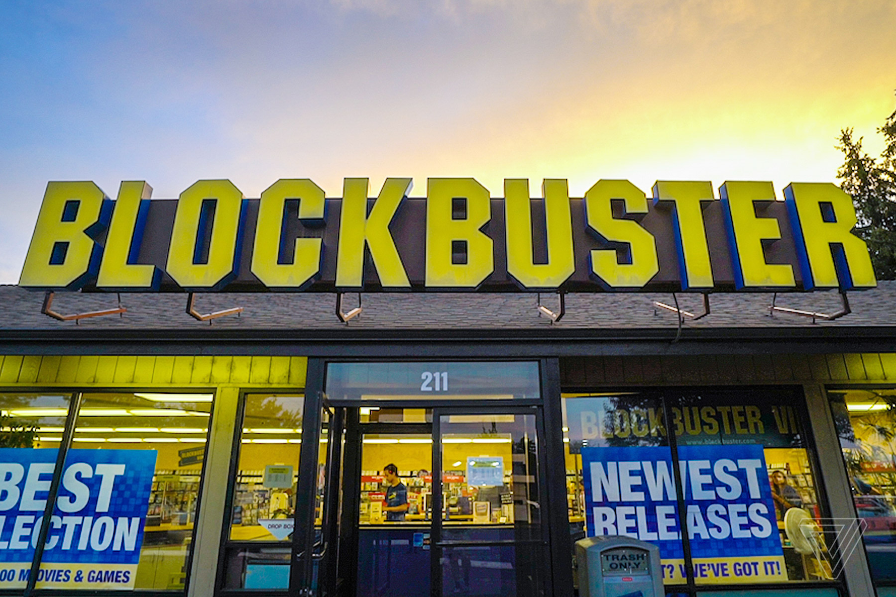

##There is apparently only one Blockbuster store left and we just don't give a fuck!

Someone reported that [there is only one Blockbuster store left in the world](https://www.blastboard.com/t/bockbuster-video-now-has-just-one-store-left-on-earth/26).  When was the last time you went to a Blockbuster?   Think, think, think..... Done?  Yeah, just what I though: you and I just don't give a fuck about Blockbuster.

But, since I started writing about something that I don't give a fuck about, might as well go ahead and finish. So, this is the article. 

After the last remaining Blockbuster Video store closed in Australia on March 31st, there is only one remaining left on earth. That location is in Bend, Oregon and seems to be a thriving location, where they write out membership cards by hand and the system is rebooted using floppy disks, apparently only something one person, the general manager, knows how to do. If you are wondering how there could be still blockbuster videos open since they went bankrupt back in 2010, the remaining stores left open were independent franchises and were separate from most of the other corporate stores, thus not part of the bankruptcy. 

###So there you go, let's shed a tear for a video rental store that we just don't give a fuck about!!!

With Love,

Ray Donovan (operator and admin of WeJustDontGiveAFuck.com).
